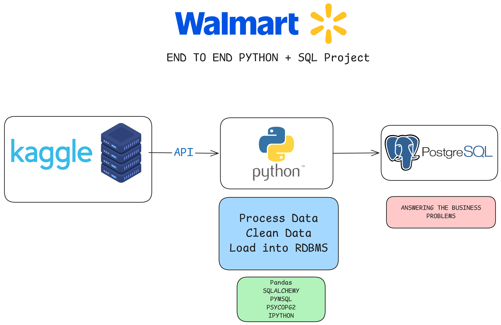

# Walmart Sales Data Analysis using SQL & Python



## Overview

This project demonstrates an end-to-end data analysis workflow using Python and PostgreSQL to analyze Walmart sales data. The objective is to clean, transform, and analyze transactional data to uncover valuable business insights through SQL queries and Python-based preprocessing.

The project covers the complete analytics pipeline—from data acquisition and cleaning to database loading and business analysis.

---

## Tech Stack

- Python
- Pandas
- NumPy
- PostgreSQL
- SQLAlchemy
- Kaggle API
- Visual Studio Code
- Git & GitHub

---

## Dataset

The dataset used in this project is publicly available on Kaggle.

Dataset:
https://www.kaggle.com/najir0123/walmart-10k-sales-datasets

---

## Project Workflow

### Step 1 — Environment Setup

- Created project structure
- Configured Python virtual environment
- Installed required libraries

---

### Step 2 — Dataset Download

Downloaded the Walmart Sales dataset using the Kaggle API.

---

### Step 3 — Data Loading

Loaded the dataset into Pandas for preprocessing and exploration.

---

### Step 4 — Data Exploration

Performed exploratory data analysis to understand

- Dataset dimensions
- Missing values
- Data types
- Duplicate records
- Summary statistics

---

### Step 5 — Data Cleaning

Cleaning tasks included

- Removing duplicates
- Handling missing values
- Correcting data types
- Formatting numerical columns
- Data validation

---

### Step 6 — Feature Engineering

Created calculated columns such as Total Amount to simplify business analysis.

---

### Step 7 — Database Integration

Loaded the cleaned dataset into PostgreSQL using SQLAlchemy.

---

# SQL Business Problems

The following business questions were solved using PostgreSQL.

---

## 1. Payment Method Analysis

**Business Problem**

Identify all payment methods and determine:

- Number of transactions
- Total quantity sold

```sql
SELECT
    payment_method,
    COUNT(*) AS no_payments,
    SUM(quantity) AS no_qty_sold
FROM walmart
GROUP BY payment_method;
```

---

## 2. Highest Rated Category in Each Branch

**Business Problem**

Determine which product category has the highest average customer rating in every branch.

```sql
WITH rating_cte AS
(
SELECT
branch,
category,
AVG(rating) AS avg_rating,
RANK() OVER(
PARTITION BY branch
ORDER BY AVG(rating) DESC
) AS rank
FROM walmart
GROUP BY branch, category
)

SELECT *
FROM rating_cte
WHERE rank = 1;
```

---

## 3. Busiest Day for Every Branch

**Business Problem**

Identify the day of the week with the highest transaction volume for each branch.

```sql
SELECT *
FROM
(
SELECT
branch,
TO_CHAR(TO_DATE(date,'DD/MM/YY'),'Day') AS day_name,
COUNT(*) AS total_transactions,
RANK() OVER(
PARTITION BY branch
ORDER BY COUNT(*) DESC
) AS rank
FROM walmart
GROUP BY branch, day_name
)
WHERE rank = 1;
```

---

## 4. Quantity Sold by Payment Method

**Business Problem**

Determine how many products were sold through each payment method.

```sql
SELECT
payment_method,
SUM(quantity) AS quantity_sold
FROM walmart
GROUP BY payment_method;
```

---

## 5. Rating Statistics by City and Category

**Business Problem**

Calculate the minimum, maximum, and average customer rating for every category in each city.

```sql
SELECT
city,
category,
MIN(rating) AS minimum_rating,
MAX(rating) AS maximum_rating,
AVG(rating) AS average_rating
FROM walmart
GROUP BY city, category
ORDER BY city, category;
```

---

## 6. Profit Analysis by Category

**Business Problem**

Calculate total revenue and estimated profit for each product category.

```sql
SELECT
category,
SUM(total) AS total_revenue,
SUM(total * profit_margin) AS profit
FROM walmart
GROUP BY category
ORDER BY profit DESC;
```

---

## 7. Most Preferred Payment Method by Branch

**Business Problem**

Identify the most frequently used payment method for every branch.

```sql
WITH payment_cte AS
(
SELECT
branch,
payment_method,
COUNT(*) AS total_transactions,
RANK() OVER(
PARTITION BY branch
ORDER BY COUNT(*) DESC
) AS rank
FROM walmart
GROUP BY branch,payment_method
)

SELECT
branch,
payment_method,
total_transactions
FROM payment_cte
WHERE rank=1;
```

---

## 8. Sales Shift Analysis

**Business Problem**

Determine the number of transactions occurring during Morning, Afternoon, and Evening shifts for each branch.

```sql
SELECT
branch,
COUNT(*) AS transaction_count,
CASE
WHEN EXTRACT(HOUR FROM time::time) < 12 THEN 'Morning'
WHEN EXTRACT(HOUR FROM time::time) BETWEEN 12 AND 17 THEN 'Afternoon'
ELSE 'Evening'
END AS shift
FROM walmart
GROUP BY branch, shift
ORDER BY branch, transaction_count DESC;
```

---

## 9. Revenue Decline Analysis

**Business Problem**

Identify branches that experienced the highest year-over-year decline in revenue.

```sql
WITH revenue2023 AS
(
SELECT
branch,
SUM(total) AS revenue
FROM walmart
WHERE EXTRACT(YEAR FROM TO_DATE(date,'DD/MM/YY'))=2023
GROUP BY branch
),

revenue2022 AS
(
SELECT
branch,
SUM(total) AS revenue
FROM walmart
WHERE EXTRACT(YEAR FROM TO_DATE(date,'DD/MM/YY'))=2022
GROUP BY branch
)

SELECT
r2.branch,
r2.revenue AS previous_year,
r1.revenue AS current_year,
ROUND(
100*((r2.revenue-r1.revenue)::numeric/r2.revenue),
2
) AS percentage_decrease
FROM revenue2023 r1
JOIN revenue2022 r2
ON r1.branch=r2.branch
WHERE r2.revenue>r1.revenue
ORDER BY percentage_decrease DESC
LIMIT 5;
```

---

## Project Structure

```
Walmart_Data_Analysis/
│
├── Walmart.csv
├── walmart_clean_data.csv
├── walmart.sql
├── walmart.ipynb
├── unzip_dataset.py
├── requirements.txt
├── README.md
├── .gitignore
└── images/
    └── walmart_project_pipeline.png
```

---

## Installation

Clone the repository

```bash
git clone https://github.com/Ayanonmyous/Walmart_Data_Analysis.git
```

Install dependencies

```bash
pip install -r requirements.txt
```

Run the notebook or execute the SQL queries inside `walmart.sql`.

---

## Key Insights

- Customer payment preferences
- Branch-wise sales performance
- Product category profitability
- Customer rating trends
- Shift-wise transaction analysis
- Year-over-year revenue comparison

---

## Future Improvements

- Interactive Power BI Dashboard
- Tableau Dashboard
- Automated ETL Pipeline
- Docker Support
- Streamlit Web Application

---

## Acknowledgements

Dataset: Kaggle Walmart Sales Dataset

Inspired by real-world retail business analytics and SQL problem-solving.